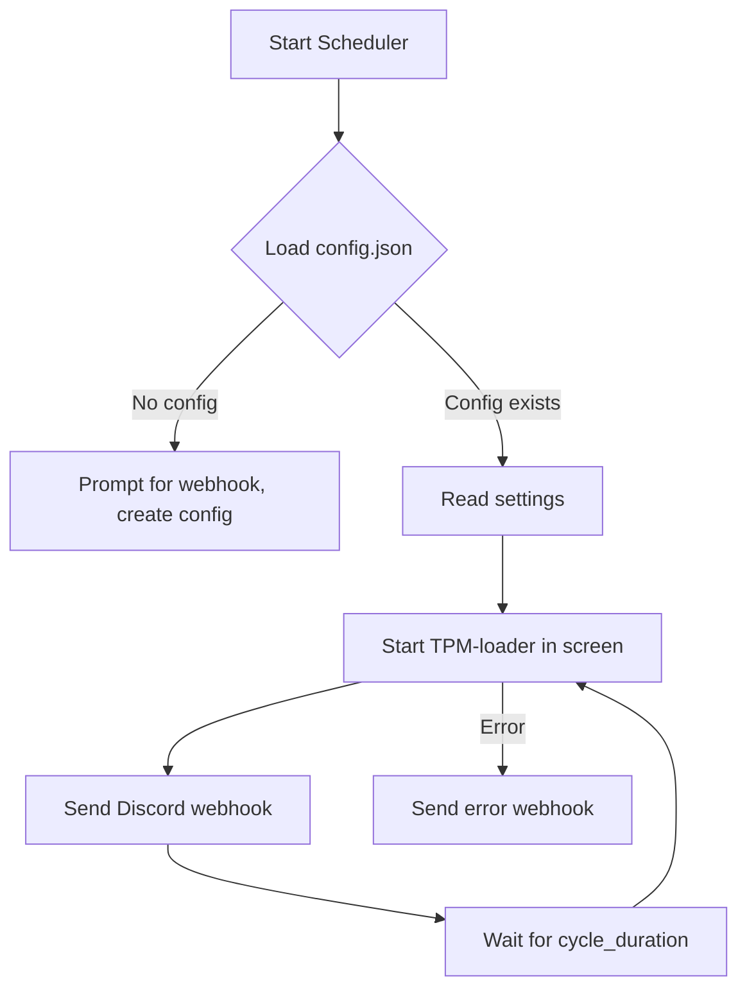

# 

<p align="center">
  <a href="https://github.com/CoreClientIO/TPM-Scheduler"></a>
  <a href="https://github.com/CoreClientIO/TPM-Scheduler"></a>
  <a href="https://img.shields.io/badge/python-3.7%2B-blue?style=flat-square"></a>
  <a href="https://discord.gg/VSBBfr5UTZ"></a>
</p>

<h1 align="center">CoreClient TPM-Scheduler</h1>

<p align="center">
  <b>A beautiful, robust process scheduler for TPM-loader-linux.<br>
  Automatic restarts, Discord webhooks, and a modern console UI.<br>
  <i>Programmed by NonNull</i></b>
</p>

---

##  Features

- 🔄 **Automatic restarts** with customizable duration
- 🎨 **Rich console interface** with beautiful formatting
- 📊 **Real-time status display**
- 🔔 **Discord webhook notifications** (white style, emoji, avatar, status)
- 📝 **Comprehensive logging**
- ⚙️ **JSON configuration management**
- 🛡️ **Graceful shutdown handling**
- 📦 **Modular, production-ready architecture**
- 🚀 **Standalone Linux executable** (no Python needed at runtime)

---

##  Installation

```bash
git clone https://github.com/CoreClientIO/TPM-Scheduler.git
cd TPM-Scheduler
chmod +x setup.sh
./setup.sh
```

Everything is automated. The binary will be ready to use as `./tpm-scheduler`.

---

## 🤖 Automated Service Setup (Recommended)

For 24/7 operation, run:

```bash
./setup_service.sh
```

This will:
- Move the binary to `/usr/local/bin/`
- Create and enable a systemd service
- Start the scheduler in the background
- Show you all the commands you need for management

---

## 🖥️ Usage

**From Source:**
```bash
python main.py
```

**From Executable:**
```bash
./tpm-scheduler
```

---

## ⚙️ Configuration

On first run, a `config.json` will be created. You can edit it to customize:

```json
{
    "screen_name": "TPM",
    "command": "./TPM-loader-linux",
    "webhook_url": "https://discord.com/api/webhooks/...",
    "log_level": "INFO",
    "log_file": "tpm-scheduler.log",
    "cycle_duration": "1h"
}
```
- `cycle_duration` supports formats like `10s`, `5m`, `1h`, `1d`.
- No more prompts on every start: just set your duration in the config!

---

## 🛠️ How it Works



---

## 📸 Screenshots

<p align="center">
  
  <br>
  <i>Modern, beautiful status panel</i>
</p>
<p align="center">
  
  <br>
  <i>White-style Discord webhook with emoji, avatar, and status</i>
</p>

---

## 🖥️ Service Management

After running `./setup_service.sh`, you can:

- **Restart:**
  ```bash
  sudo systemctl restart tpm-scheduler
  ```
- **Stop:**
  ```bash
  sudo systemctl stop tpm-scheduler
  ```
- **Start:**
  ```bash
  sudo systemctl start tpm-scheduler
  ```
- **Status:**
  ```bash
  systemctl status tpm-scheduler
  ```
- **Logs:**
  ```bash
  journalctl -u tpm-scheduler -f
  ```

---

## 📝 Logs

All activities are logged to `tpm-scheduler.log` with timestamps and details.

---

## 💬 Community & Support

- [GitHub Issues](https://github.com/CoreClientIO/TPM-Scheduler/issues)
- [Discord Support](https://discord.gg/VSBBfr5UTZ)

For issues and support, check the logs in `tpm-scheduler.log` for detailed error information.

---

## 🪪 License

This project is part of the CoreClient ecosystem. See [LICENSE](LICENSE).

---

<p align="center">
  <b>Made with ❤️ by NonNull & the CoreClient team</b>
</p>